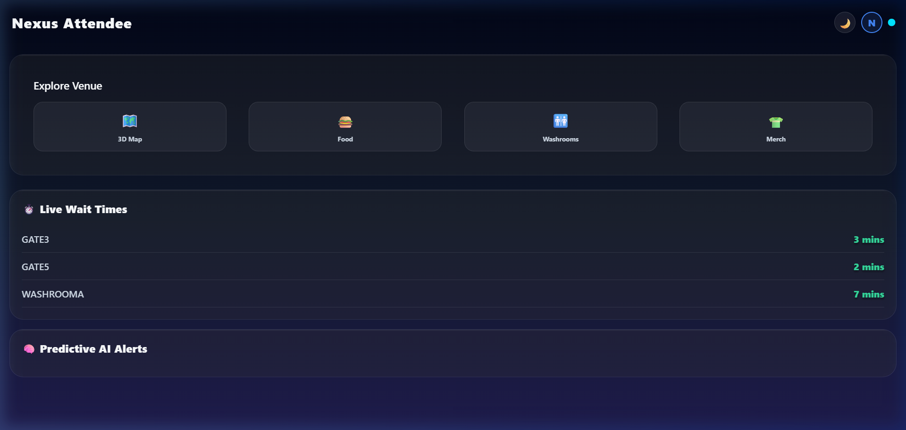
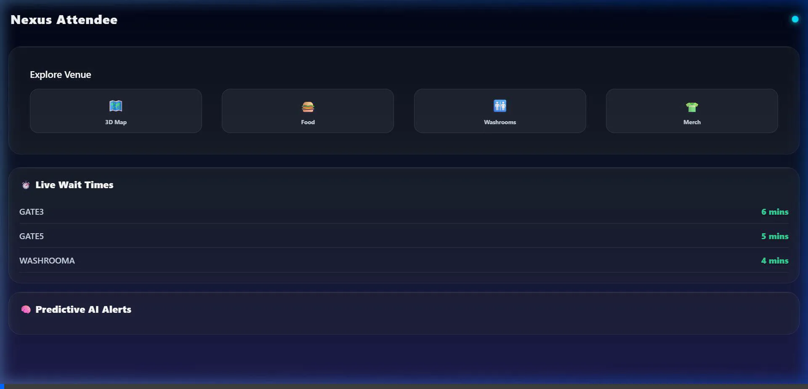
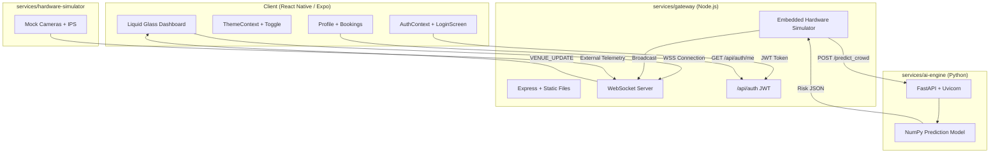

<div align="center">
  
  <h1>Nexus Smart Venue Management</h1>
  <p>A production-ready microservices architecture optimizing physical event experiences using Predictive AI, Liquid Glass Mobile UIs, and real-time IoT Gateways.</p>
  <br/>
  <a href="https://nexus-gateway-369865779033.us-central1.run.app"></a>
  
  
</div>

---

## ✨ Project Overview

Built for the **Google Promptwars Virtual Challenge**, this framework drastically improves the attendee physical event experience at large-scale sporting venues through predictive queue management, smart facility routing, and actionable crowd navigation.

We transitioned our initial architectural mockup into a completely live, fully-functioning multi-service cloud deployment consisting of 4 dedicated microservice nodes — now hosted on **Google Cloud Run** with automatic scaling and zero-downtime deployments.

---

## 🎯 Features

| Feature | Description |
|---------|-------------|
| 🪟 **Liquid Glass Motion UI** | Cross-platform frosted-glass aesthetic built with `react-native-reanimated`, `moti`, and `expo-blur`. Physics-based spring entrance animations at 60FPS. |
| 📊 **Live Queue Prediction** | Simulated IoT hardware sensors ping the gateway every 5 seconds to generate real-time congestion telemetry for gates, washrooms, and food courts. |
| 🧠 **Predictive AI Engine** | Python FastAPI service projects crowd occupancy 15 minutes into the future using flow-rate algorithms. Returns risk levels and reroute recommendations. |
| ⚡ **Zero-Latency WebSockets** | End-to-end real-time data pipeline: hardware → AI inference → WebSocket broadcast → React state update → UI render. |
| 🔐 **Authentication & Storage** | Real Google OAuth integration via `expo-auth-session` with JWT token generation and verification. User sessions, profiles, and venue bookings are persistently stored in **Google Cloud Firebase Firestore**. |
| 🌗 **Theme System** | Dark / Light / System-Default toggle (🌙 → ☀️ → 🖥️) with smooth animated transitions, `AsyncStorage` persistence, and complete palette switching across all UI components. |
| 🧪 **Test Suite** | 17 automated tests across 2 services — 9 gateway tests (Jest + Supertest) and 8 AI engine tests (Pytest). |

---

## 📸 Live Deployment Screenshot



> *The Nexus Attendee dashboard running live on Google Cloud Run — showing real-time gate wait times, AI predictive alerts, theme toggle (🌙), and profile icon (N) in the header.*

---

## 📽️ End-To-End Interaction Demo



> *GSAP-style staggered physics animations intersecting with simulated hardware flow data.*

---

## 🏗️ System Architecture



### Data Flow (End-to-End)

```
1. Browser → Cloud Run LB → Express serves index.html + compiled JS bundle
2. React App → auto-connects WSS to the same origin
3. Gateway HW Loop (every 5s) → generates mock queue times & crowd levels
4. Gateway → POST /predict_crowd → AI Engine → returns risk + projected occupancy
5. Gateway → merges telemetry + AI predictions → broadcasts via WebSocket
6. React state update → Moti animates Liquid Glass cards with fresh data
```

---

## 📁 Project Structure

```
promptwar_google/
├── client/                        # React Native / Expo attendee app
│   ├── App.js                     # Root (AuthProvider → ThemeProvider → DashboardApp)
│   ├── src/
│   │   ├── context/
│   │   │   ├── AuthContext.js     # Real Google OAuth state + Cloud Run API handoff
│   │   │   └── ThemeContext.js    # Dark/Light/System with AsyncStorage
│   │   ├── screens/
│   │   │   ├── LoginScreen.js     # Full-screen OAuth provider selection
│   │   │   └── ProfileScreen.js   # User avatar, provider badge, bookings list loaded from Firestore
│   │   ├── components/
│   │   │   ├── GlassCard.js       # Theme-aware frosted glass wrapper
│   │   │   ├── ThemeToggle.js     # Animated 🌙/☀️/🖥️ cycle button
│   │   │   └── ProfileIcon.js    # Provider-colored circular avatar
│   │   └── themes/
│   │       └── colors.js          # 65+ design tokens for Dark + Light palettes
│   └── __tests__/                 # Client test suite
├── services/
│   ├── gateway/                   # Node.js API Gateway (port 3000)
│   │   ├── index.js               # Express + WSS + embedded HW simulator loop
│   │   ├── firebase.js            # Firebase Admin SDK initialization
│   │   ├── routes/auth.js         # JWT auth + Google Token verification + Firestore ops
│   │   ├── public/                # Compiled Expo static web bundle
│   │   └── tests/gateway.test.js  # 9 tests (Jest + Supertest)
│   ├── ai-engine/                 # Python FastAPI AI service (port 8000)
│   │   ├── main.py                # /health, /predict_crowd endpoints
│   │   ├── Procfile               # Cloud Run entry point
│   │   └── tests/test_main.py     # 8 tests (Pytest)
│   └── hardware-simulator/       # Standalone IoT mock (local dev only)
│       └── sim_cameras.js
├── dashboard-preview/             # Static HTML/CSS/JS early prototype
├── docs/                          # Logo, demo recordings, screenshots
│   ├── logo.png
│   ├── demo.webp
│   └── live-dashboard.png
├── CONTRIBUTING.md                # Fork, branch, PR, code style guidelines
├── .gitignore
└── README.md
```

---

## 💻 Tech Stack

| Layer | Technologies |
|-------|-------------|
| **Frontend** | React Native (Expo 54), Moti 0.30, Reanimated 4, `expo-auth-session` |
| **Gateway** | Node.js 18+, Express 4, `ws` 8, `firebase-admin`, `google-auth-library` |
| **AI Backend** | Python 3.10+, FastAPI, Uvicorn, NumPy, Pydantic |
| **IoT Simulator** | Node.js vanilla scripts (embedded in gateway for cloud) |
| **Testing** | Jest 29 + Supertest 6 (Gateway), Pytest 7 + HTTPx (AI Engine) |
| **Deployment** | Google Cloud Run, Cloud Build (Buildpacks), Artifact Registry |
| **CI/CD** | Source-based deployment via `gcloud run deploy --source .` |

---

## 🚀 How to Run Locally

Open **4 separate terminals** and run:

```bash
# Terminal 1 — AI Engine
cd services/ai-engine
pip install -r requirements.txt
python -m uvicorn main:app --port 8000

# Terminal 2 — API Gateway
cd services/gateway
npm install
node index.js

# Terminal 3 — Hardware Simulator (optional, gateway has built-in loop)
cd services/hardware-simulator
node sim_cameras.js

# Terminal 4 — Client (Expo Web)
cd client
npm install
npx expo start -c --web
```

Open `http://localhost:8081` in your browser. You'll see the Login Screen → sign in → Dashboard with live data.

---

## 🧪 Running Tests

```bash
# AI Engine — 8 tests
cd services/ai-engine && python -m pytest tests/ -v

# Gateway — 9 tests
cd services/gateway && npm test
```

**Test Coverage:**

| Suite | Tests | What's Covered |
|-------|-------|---------------|
| Gateway | 9 | Health endpoint, Google login, Instagram login, missing provider, missing email, JWT auth/me, invalid token, no token, logout |
| AI Engine | 8 | Health check, low/medium/high risk predictions, occupancy formula validation, zero occupancy edge case, missing fields (422) |

---

## ☁️ Cloud Deployment (Google Cloud Run)

The system runs as **2 independent Cloud Run services** under GCP project `nexus-venue-190880`, region `us-central1`:

| Service | Rev | Role | URL |
|---------|-----|------|-----|
| **nexus-gateway** | 00003 | Node.js Gateway + Static Frontend + Auth API + HW Simulator | [nexus-gateway-369865779033.us-central1.run.app](https://nexus-gateway-369865779033.us-central1.run.app) |
| **nexus-ai** | 00001 | Python FastAPI Predictive AI Engine | `nexus-ai-369865779033.us-central1.run.app` |

### How it works in production
- The gateway container serves the **compiled Expo Web bundle** as static files
- An **embedded hardware simulator** loop generates mock telemetry every 5 seconds
- The gateway calls the **AI service** via internal HTTP for crowd risk predictions
- Results are **broadcast via WebSocket** to all connected browsers in real-time
- Everything is **serverless** — scales to zero when idle, scales up automatically under load

### API Endpoints

| Method | Endpoint | Description |
|--------|----------|-------------|
| `GET` | `/` | Serves the React Native web app |
| `GET` | `/api/health` | Gateway health check |
| `POST` | `/api/auth/login` | Verifies Google ID tokens, upserts to Firestore, returns JWT session |
| `GET` | `/api/auth/me` | Fetch authenticated user data & live bookings directly from Firestore |
| `POST` | `/api/auth/logout` | Invalidate session |
| `WSS` | `/` | WebSocket for real-time venue data |

---

## 🤝 Contributing

See [CONTRIBUTING.md](./CONTRIBUTING.md) for guidelines on setting up the development environment, branch naming conventions, PR requirements, and code style.

---

## 📄 License

MIT — See [LICENSE](./LICENSE) for details.
