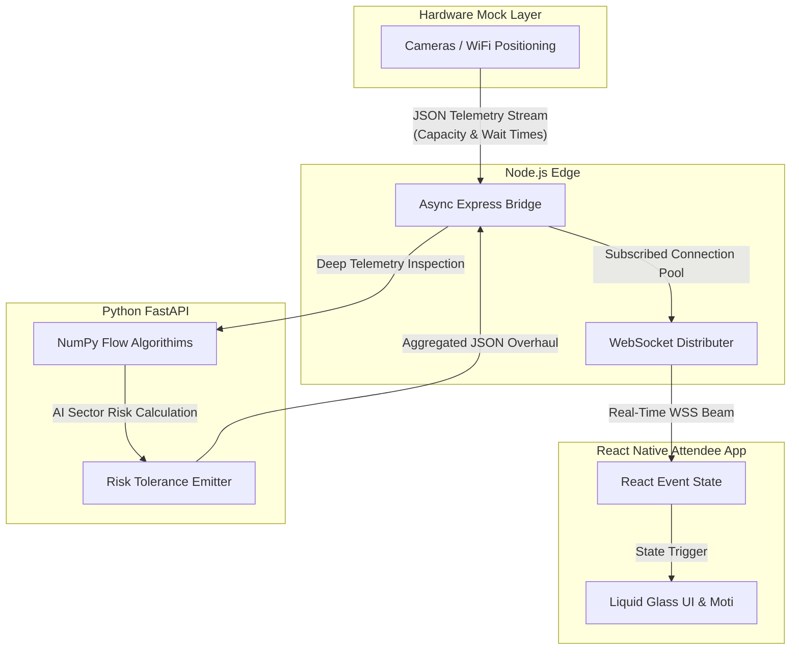

  
  <h1>Nexus Smart Venue Management</h1>
  
A production-ready microservices architecture optimizing physical event experiences using Predictive AI, Liquid Glass Mobile UIs, and real-time IoT Gateways.

   
  

## ✨ Project Overview
Built for the Google Promptwars Virtual Challenge, this framework drastically improves the attendee physical event experience at large-scale sporting venues through predictive queue management, smart facility routing, and actionable crowd navigation. 

We transitioned our initial architectural mockup into a completely live, fully-functioning multi-service cloud deployment consisting of 4 dedicated node architectures — now hosted on **Google Cloud Run**.

## 🎯 Features
- **Liquid Glass Motion UI:** Built cross-platform beautifully using `react-native-reanimated`, `moti`, and `expo-blur`.
- **Live Queue Prediction:** Simulated hardware sensors ping localized node gateways to calculate congestion.
- **Predictive AI Engine:** FastApi backend processes streaming matrices to dynamically issue routing redirects.
- **Zero-Latency WebSockets:** The entire loop completes in real-time, bridging hardware streams directly to the Attendee’s mobile device.

---

## 📽️ End-To-End Live Demo
Observe the newly integrated GSAP-style staggered presentation physics intersecting with the simulated hardware flow data:

---

## 🏗️ Detailed System Architecture
This diagram outlines the complete multi-terminal local deployment architecture that drives this app natively and locally:

---

## 💻 Tech Stack
1. **Frontend:** React Native (Expo), Moti (Reanimated 3), React DOM.
2. **Gateway:** Node.js, Express, `ws` (WebSockets Webpack).
3. **AI Backend:** Python 3, FastAPI, Uvicorn, NumPy, Pydantic.
4. **IoT Simulator:** Node Vanilla Scripts.

## 🚀 How to Run Locally 
To boot this exact implementation frame upon your local machine:
1. **Boot Python Backend:** `cd ai-service` -> `pip install -r requirements.txt` -> `python -m uvicorn main:app --port 8000`
2. **Boot API Gateway:** `cd backend-service` -> `node index.js`
3. **Boot Hardware Simulator:** `cd hardware-mocks` -> `node sim_cameras.js`
4. **Boot App Interface:** `cd mobile-app` -> `npx expo start -c --web`

## ☁️ Cloud Deployment (Google Cloud Run)

The entire system is deployed as two independent Cloud Run services under GCP project `nexus-venue-190880`:

| Service | Role | URL |
|---------|------|-----|
| **nexus-gateway** | Node.js API Gateway + Static React Frontend + Embedded Hardware Simulator | [nexus-gateway-369865779033.us-central1.run.app](https://nexus-gateway-369865779033.us-central1.run.app) |
| **nexus-ai** | Python FastAPI Predictive AI Engine | `nexus-ai-369865779033.us-central1.run.app` |

The gateway serves the compiled Expo Web bundle, runs the hardware mock loop internally, and calls the AI service for real-time crowd predictions — all serverless and auto-scaling.

## 📄 License
MIT
