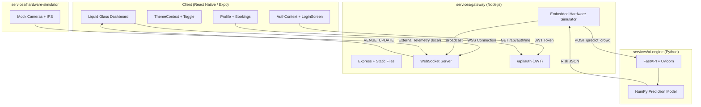

<div align="center">
  
  <h1>Nexus Smart Venue Management</h1>
  <p>A production-ready microservices architecture optimizing physical event experiences using Predictive AI, Liquid Glass Mobile UIs, and real-time IoT Gateways.</p>
  <br/>
  <a href="https://nexus-gateway-369865779033.us-central1.run.app"></a>
</div>

## ✨ Project Overview
Built for the Google Promptwars Virtual Challenge, this framework drastically improves the attendee physical event experience at large-scale sporting venues through predictive queue management, smart facility routing, and actionable crowd navigation.

We transitioned our initial architectural mockup into a completely live, fully-functioning multi-service cloud deployment consisting of 4 dedicated node architectures — now hosted on **Google Cloud Run**.

## 🎯 Features
- **Liquid Glass Motion UI:** Built cross-platform beautifully using `react-native-reanimated`, `moti`, and `expo-blur`.
- **Live Queue Prediction:** Simulated hardware sensors ping localized node gateways to calculate congestion.
- **Predictive AI Engine:** FastAPI backend processes streaming matrices to dynamically issue routing redirects.
- **Zero-Latency WebSockets:** The entire loop completes in real-time, bridging hardware streams directly to the Attendee's mobile device.
- **OAuth Authentication:** Mock Google & Instagram login system with JWT sessions, user profiles, and venue bookings.
- **Theme System:** Dark / Light / System-Default toggle with smooth animated transitions and full palette switching.

---

## 📽️ End-To-End Live Demo
Observe the newly integrated GSAP-style staggered presentation physics intersecting with the simulated hardware flow data:


---

## 🏗️ Detailed System Architecture



---

## 📁 Project Structure

```
promptwar_google/
├── client/                        # React Native / Expo attendee app
│   ├── App.js                     # Root component (Auth + Theme wrappers)
│   ├── src/
│   │   ├── context/
│   │   │   ├── AuthContext.js     # OAuth state management
│   │   │   └── ThemeContext.js    # Dark/Light/System theme management
│   │   ├── screens/
│   │   │   ├── LoginScreen.js     # Google + Instagram login
│   │   │   └── ProfileScreen.js   # User profile + venue bookings
│   │   ├── components/
│   │   │   ├── GlassCard.js       # Frosted glass card wrapper
│   │   │   ├── ThemeToggle.js     # 🌙/☀️/🖥️ toggle button
│   │   │   └── ProfileIcon.js     # Header avatar icon
│   │   └── themes/
│   │       └── colors.js          # Dark + Light palettes
│   └── __tests__/                 # Client test suite
├── services/
│   ├── gateway/                   # Node.js API Gateway
│   │   ├── index.js               # Express + WebSocket + HW simulator
│   │   ├── routes/auth.js         # JWT auth endpoints
│   │   └── tests/                 # Gateway test suite
│   ├── ai-engine/                 # Python FastAPI AI service
│   │   ├── main.py                # Prediction endpoints
│   │   └── tests/                 # AI test suite
│   └── hardware-simulator/       # IoT telemetry mock
│       └── sim_cameras.js
├── dashboard-preview/             # Static HTML/CSS/JS early prototype
├── docs/                          # Logo, demo recordings
├── CONTRIBUTING.md                # Contribution guidelines
└── README.md
```

---

## 💻 Tech Stack
| Layer | Technologies |
|-------|-------------|
| **Frontend** | React Native (Expo), Moti, Reanimated 3, expo-blur, expo-linear-gradient |
| **Gateway** | Node.js, Express, `ws`, JSON Web Tokens |
| **AI Backend** | Python 3, FastAPI, Uvicorn, NumPy, Pydantic |
| **IoT Simulator** | Node.js vanilla scripts |
| **Testing** | Jest + Supertest (JS), Pytest (Python) |
| **Deployment** | Google Cloud Run, Cloud Build, Artifact Registry |

## 🚀 How to Run Locally
```bash
# Terminal 1 — AI Engine
cd services/ai-engine && pip install -r requirements.txt && python -m uvicorn main:app --port 8000

# Terminal 2 — API Gateway
cd services/gateway && npm install && node index.js

# Terminal 3 — Hardware Simulator
cd services/hardware-simulator && node sim_cameras.js

# Terminal 4 — Client (Expo Web)
cd client && npm install && npx expo start -c --web
```

## 🧪 Running Tests
```bash
# AI Engine
cd services/ai-engine && python -m pytest tests/ -v

# Gateway
cd services/gateway && npm test

# Client
cd client && npm test
```

## ☁️ Cloud Deployment (Google Cloud Run)

The entire system is deployed as two independent Cloud Run services under GCP project `nexus-venue-190880`:

| Service | Role | URL |
|---------|------|-----|
| **nexus-gateway** | Node.js API Gateway + Static React Frontend + Embedded Hardware Simulator | [nexus-gateway-369865779033.us-central1.run.app](https://nexus-gateway-369865779033.us-central1.run.app) |
| **nexus-ai** | Python FastAPI Predictive AI Engine | `nexus-ai-369865779033.us-central1.run.app` |

The gateway serves the compiled Expo Web bundle, runs the hardware mock loop internally, and calls the AI service for real-time crowd predictions — all serverless and auto-scaling.

## 🤝 Contributing

See [CONTRIBUTING.md](./CONTRIBUTING.md) for guidelines on how to set up the development environment, branch naming, and PR requirements.

## 📄 License
MIT
